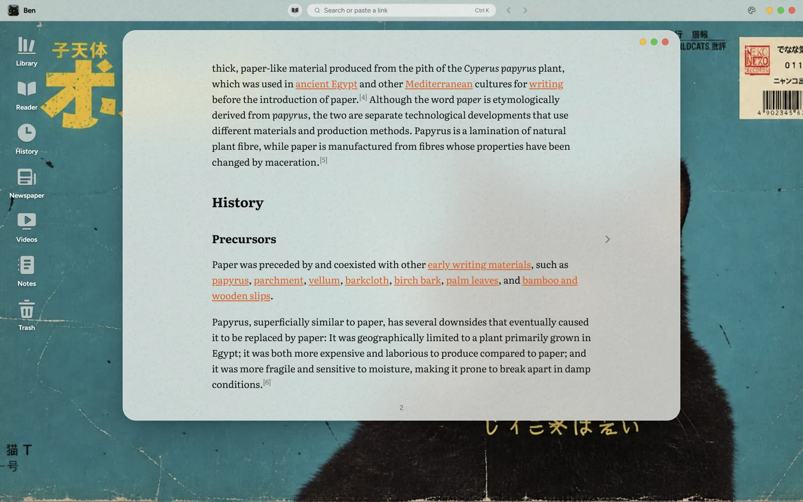
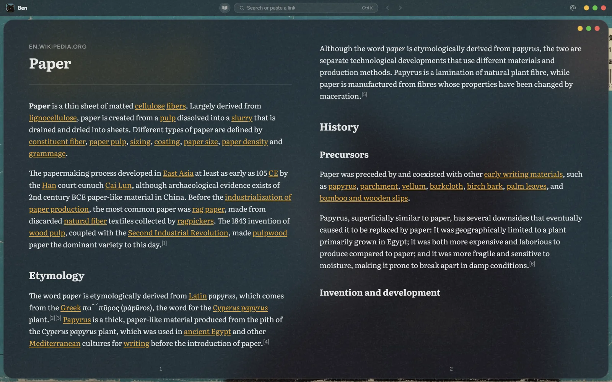
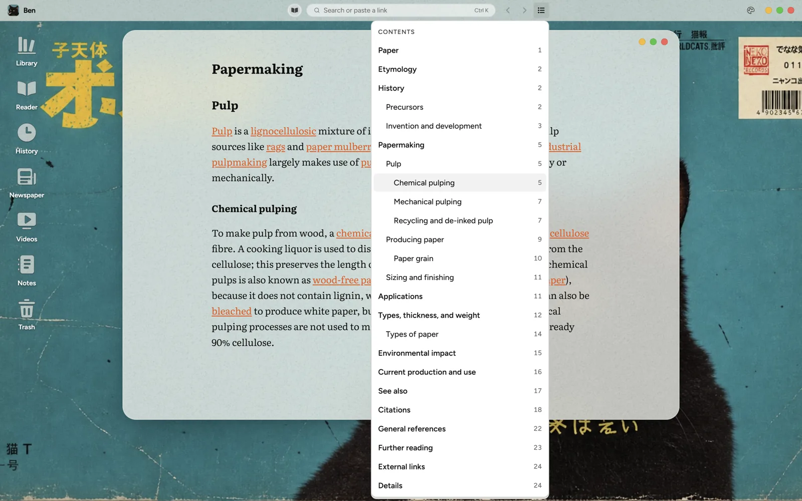
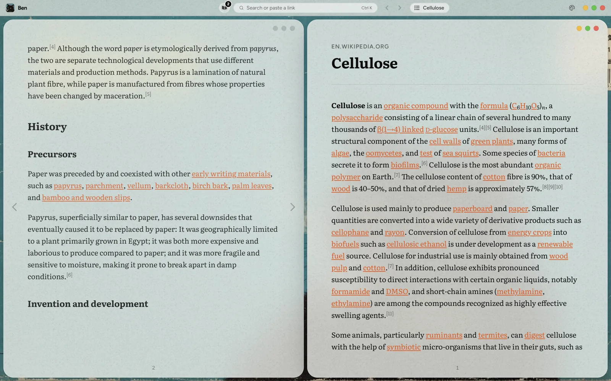
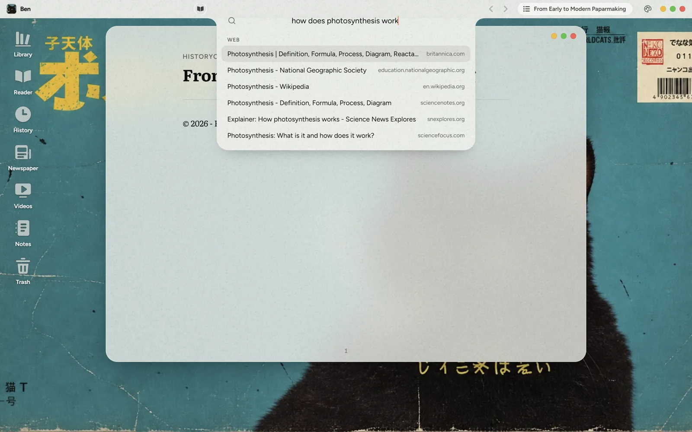
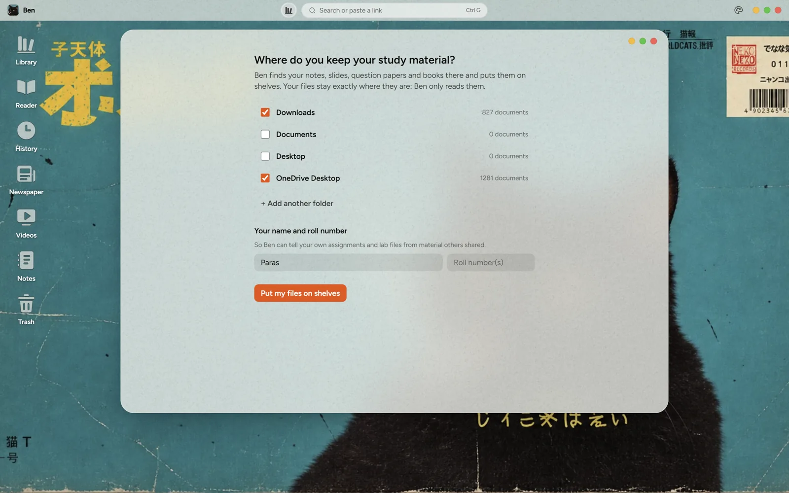

<p align="center">
  
</p>

<h1 align="center">Ben</h1>

<p align="center">
  <b>A calm study and reading space for Windows.</b><br />
  Clean articles you turn like a book, your own study files sorted onto shelves, and nothing else competing for your attention.
</p>

<p align="center">
  
</p>

---

## Why Ben

Studying online is noisy. Articles come wrapped in ads, pop-ups and "recommended for you", and the free material
students actually rely on (newspaper PDFs forwarded on WhatsApp, notes and question papers from friends, books
from Telegram) piles up in Downloads under names like `final_final(2).pdf`.

Ben is not a general web browser. It's a small desktop of its own, made of frosted "matte glass" windows, built
for one thing: **finding, reading and keeping study material, calmly.**

- **Read without clutter.** Paste a link and the article comes back clean, set as pages you turn, with contents.
- **Find your own files.** Ben looks through the folders you choose and puts notes, slides, question papers,
  books and assignments on shelves by subject. Your files stay exactly where they are; Ben only reads them.
- **Local first.** Everything runs on your PC. Nothing is uploaded; the network is used only to fetch the pages
  you open and the words you search for.

> Ben is early and under active development, built for a small group of students first.

## What it does today

### Reader: articles as a book



- Paste a link (or pick a search result) and Ben extracts the article (Mozilla Readability), cleans it
  (no ads, scripts, sign-up boxes or "follow us" blocks), and lays it out as **pages you turn**: one page in a
  normal window, **two facing pages** when there's room.
- **Turn pages** with ← → / Space / PageUp/PageDown, or by clicking the page margins.
- **Contents** pill on the top bar shows the section you're in; click it for every section with its page number.
- **Back and forward** per window (Alt+← / Alt+→, mouse side buttons), returning to the exact passage you left.
- Resizing, maximising or switching between one and two pages **keeps your place**.
- Text in **Literata**, a typeface designed for long reading on screens.



### Windows, side by side and Ben View

- Several Reader windows at once. **Right-click a link** for Open, Open in new window, **Open side by side**
  (two articles in the two halves of the screen) or Copy link. Ctrl+click opens a new window directly.
- **Ben View** (Ctrl+Space) shows every open window as a card; apps with several windows stack and fan out.
- Windows behind the front one are quietly dimmed; clicking one brings it forward without a jolt.



### Search from the top bar



- Click the search pill or press **Ctrl+G** (or Ctrl+K): the bar drips down into a notch.
- Results as you type: pages you've **read before**, **Wikipedia** articles, and the **web**.
- Paste a link to open it straight away. Select text in an article and choose **Search for** from the right-click menu.

### Library: your study files, on shelves



- First run asks **where you keep study material** (suggesting Downloads, Documents, Desktop and OneDrive with how
  many documents each holds) and your name and roll number, so Ben can tell **your own work** from shared material.
- Ben reads each file's name, folder, page count and first pages (PDF, Word, PowerPoint) and recognises what it
  is: notes, slides, question papers, syllabus, books, course material, assignments, lab files, projects,
  newspapers, DPPs, mock tests, guides, forms and documents, photos. It also learns course codes (CSF206 → Advanced Java).
- Shelves by **subject** and **kind**, a **"Needs you"** shelf for files it couldn't place, and one-click
  correction from the right-click menu. PDFs and photos open inside Ben; other files in their usual program.
- New files in your folders appear by themselves. Ben **never moves, renames or deletes** your files.

### History, themes and the rest

- **History** of everything read, grouped by day, kept across restarts.
- Light, dark, or follow Windows.
- Ben's own right-click menus everywhere (the browser's menu, with its window-wiping Reload, is switched off).

## Roadmap

| Status | What |
| --- | --- |
| In progress | **Newspapers:** e-paper PDFs read as a clean paper (masthead, sections, articles in order, no ads) |
| Next | **OCR** (Windows' built-in text recognition) for scanned papers and photos of notes, including Hindi |
| Next | **Syllabus units:** file slides, notes and questions into each subject's units, and show what's covered |
| Planned | **AI help** (bring your own key): ask with sources, explain a selection, summaries, flowcharts that follow your reading |
| Planned | **Focus timer** with a break screen (a cat or a truck crossing the desktop with a quote) |
| Planned | **Videos:** YouTube in a Ben window, with captions as a readable transcript |
| Idea | **Ben Turbo:** an optional engine for heavy local jobs, woken only when needed ("Goodnight Moon") |

## Running Ben

Ben is a [Tauri 2](https://tauri.app) app: a Rust shell around a React interface, drawn by **WebView2**
(Microsoft Edge's engine, built into Windows 10 and 11).

**You need:** Windows 10 or 11, [Node.js](https://nodejs.org) 20+, and [Rust](https://rustup.rs) (stable).

```bash
npm install
npm run app          # run Ben as a desktop app (the first build takes a few minutes)
```

Other commands:

| Command | What |
| --- | --- |
| `npm run dev` | The interface alone in a browser at http://localhost:5173 (Library, search and the Reader need the app) |
| `npx tsc -b` | Type check |
| `npx oxlint src` | Lint |
| `npx vite build` | Production build of the interface (prints bundle sizes) |
| `npx tauri build --no-bundle` | Release program at `src-tauri/target/release/app.exe` |

## How it's put together

```
src/
  desktop/      the desktop: Ben Island (top bar), windows, Ben View, search notch, menus, theme
  reader/       article download, extraction and clean-up, book layout (useBook), contents
  library/      recognising study files (classify.ts), shelves, first-run setup
  newspaper/    newspaper PDF layout reading (work in progress)
  search/       history, Wikipedia and web search
  history/      reading history
src-tauri/      the Rust side: window, web downloads, Library file reading and folder watching
```

The detailed design notes, decisions already made, and pitfalls hit along the way are in
[`CLAUDE.md`](CLAUDE.md).

## Privacy

- Your files are **read, never changed**, and nothing about them leaves your PC. The Library's index is kept in
  Ben's own app data folder.
- The network is used for: pages you open, and the words you type into search (sent to Wikipedia and DuckDuckGo).
- No accounts, no tracking, no analytics.

## Credits

Ben stands on excellent open-source work:

- [Tauri](https://tauri.app), [React](https://react.dev), [Kea](https://keajs.org), [Tailwind CSS](https://tailwindcss.com)
- [Mozilla Readability](https://github.com/mozilla/readability) (Apache-2.0) for finding the article in a page
- [DOMPurify](https://github.com/cure53/DOMPurify) (Apache-2.0 / MPL-2.0) for keeping article HTML safe
- [PDF.js](https://mozilla.github.io/pdf.js/) (Apache-2.0) for reading newspaper PDFs
- [lopdf](https://github.com/J-F-Liu/lopdf), [zip](https://github.com/zip-rs/zip2), [walkdir](https://github.com/BurntSushi/walkdir), [notify](https://github.com/notify-rs/notify) (MIT / Apache-2.0) for reading and watching study files
- [Literata](https://github.com/googlefonts/literata) and [Figtree](https://github.com/erikdkennedy/figtree) typefaces (SIL Open Font License)
- The theme menu's look and keyboard handling come from [PostHog](https://github.com/PostHog/posthog) (MIT, see [`LICENSE-POSTHOG`](LICENSE-POSTHOG))

## License

Copyright © 2026 Paras Rawat. **All rights reserved** for now: this repository is private while Ben takes
shape. A license will be chosen before it's opened up. The wallpaper and cat artwork should have their sources
confirmed at that point too.
